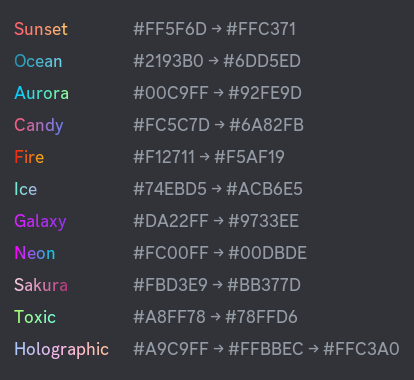
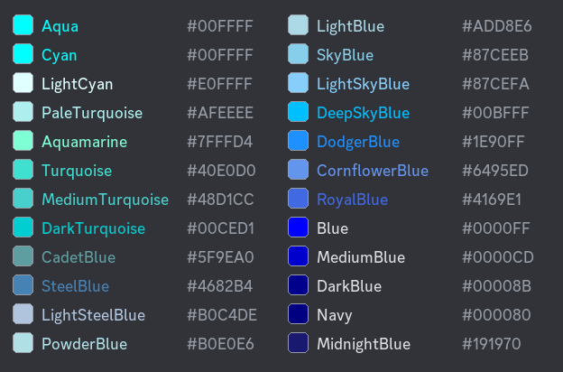

# colors

Browse gradient presets and CSS color names with their HEX codes. Pick a group from the menu: **Gradients** (shown first) or a color group (red, green, blue…). Your color doesn't change.

**Syntax:** `/colors`

**Good to know:**

* Use a color name or HEX with [`/set`](set.md), e.g. `/set royalblue`.
* Use a gradient name with [`/gradient`](gradient.md), e.g. `/gradient sunset`. Gradients need Server Boost and a [vote](../main/voting.md).
* Very dark colors are labeled in light text so you can read them. The square next to the name shows the real color.
* The same list is on the [Colors](../main/colors.md) page.
* Cooldown: 10 seconds.

***

## Bot response

<figure><figcaption></figcaption></figure>

<figure><figcaption></figcaption></figure>
