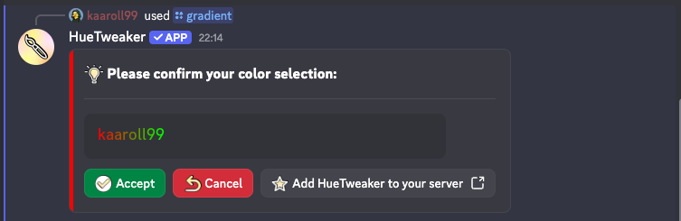

# gradient


Gradients rely on Discord's boost-gated Enhanced Role Colors. The server must have the required Server Boost level, otherwise the gradient can't be applied.


Set or change your username color using a two-color gradient. You provide a primary and a secondary color, and HueTweaker blends them into a single gradient role. Each color can be given as a HEX value (with or without a leading '#'), as a CSS color name, by copying another user's color (mention the user, e.g. @kaaroll99), or as "random".

The command generates a preview image and asks for confirmation before applying the gradient.

**Parameters:**

* `<color>` - Primary color of the gradient (required)
* `<secondary_color>` - Secondary color of the gradient (required)

**Accepted color formats:**

* Hex: F5DF4D or #F5DF4D
* CSS color names: royalblue
* Other formats supported by the parser (e.g., rgb(...), hsl(...))

**Username:**

* Copy a color from another user by mentioning them (e.g. @kaaroll99). If the selected user does not have a colored role an error will be returned.

**Notes:**

* If you don't already have a bot-managed color role, the bot will create one named `color-<YOUR_ID>` and assign it to you.
* To set a single solid color, use the `/set` command instead.
* The command is subject to a cooldown.

**Command syntax:**

* `/gradient <color> <secondary_color>`

**Command examples:**

* `/gradient f5df4d 00ff00`
* `/gradient royalblue tomato`
* `/gradient @kaaroll99 random`

***

## Bot response

<figure><figcaption></figcaption></figure>
