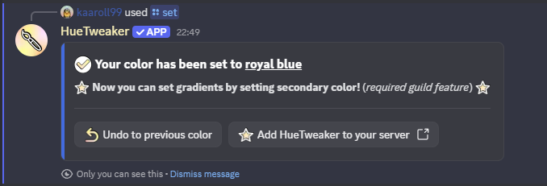

# set


Without a vote you can change your color **2 times per 30 minutes**. [Voting for HueTweaker on top.gg](../main/voting.md) removes this limit for 12 hours.


Set or change your username color. The color can be given as a HEX value (with or without a leading '#'), as a CSS color name, by copying another user's color (mention the user, e.g. @kaaroll99), or as "random" to pick a random color.

The command generates a preview image and asks for confirmation before applying the color.

**Parameters:**

* `<color>` - Color to set (required)

**Accepted color formats:**

* Hex: F5DF4D or #F5DF4D
* CSS color names: royalblue
* Other formats supported by the parser (e.g., rgb(...), hsl(...))

**Username:**

* Copy color from another user by mentioning them (e.g. @kaaroll99). If the selected user does not have a colored role an error will be returned.
* If the mentioned user has a gradient, the whole gradient is copied. Like [`/gradient`](gradient.md), this needs gradient support on the server and a vote.

**Notes:**

* If you don't already have a bot-managed color role, the bot will create one named `🎨 <your display name>` and assign it to you. The name is refreshed every time you change your color.
* Only confirmed changes count towards the free limit. Previewing and cancelling, or using the **Undo** button, doesn't use it up.
* To create a two-color gradient, use the `/gradient` command instead.
* The command is subject to a cooldown.

**Command syntax:**

* `/set <color>`

**Command examples:**

* `/set f5df4d`
* `/set royalblue`
* `/set @kaaroll99`
* `/set random`

***

## Bot response

<figure><figcaption></figcaption></figure>

<figure><figcaption></figcaption></figure>

