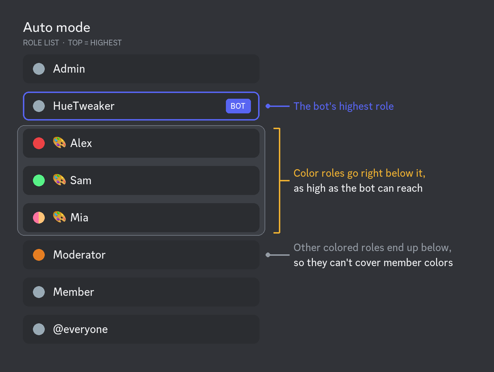
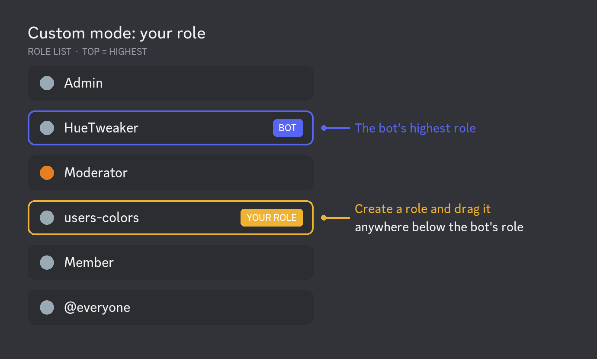
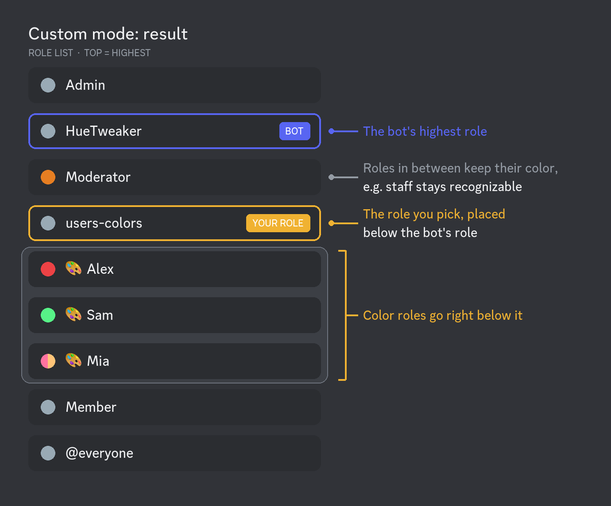
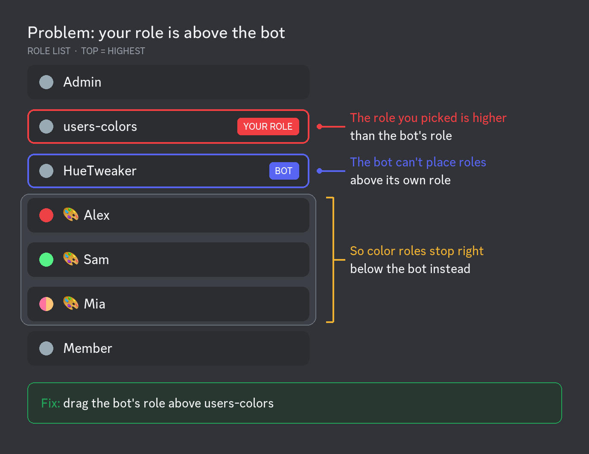
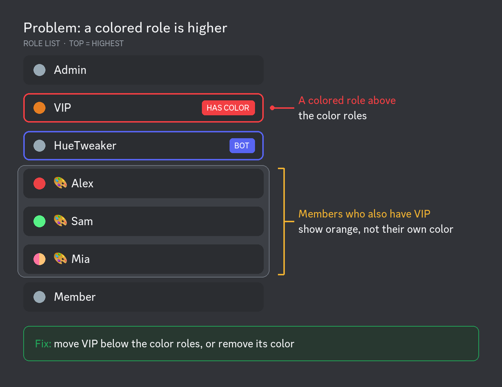

# setup toprole


Administrators only.


Choose where HueTweaker's color roles sit in the role list. Discord shows the color of a member's **highest colored role**, so color roles have to be above other colored roles to be visible.

**Syntax:** `/setup toprole <mode> [role_name]`

| Mode | Where color roles go |
| --- | --- |
| `auto` | As high as the bot can reach (just below the bot's highest role). **Default.** |
| `custom` | Directly below the role given in `role_name`. |
| `off` | At the bottom of the role list. |

**Examples:**

* `/setup toprole auto`
* `/setup toprole custom @users-colors`
* `/setup toprole off`

Color roles move as soon as you run the command, and new ones are placed the same way.

## Auto mode

The best choice for most servers. HueTweaker keeps all color roles together, right below its own role, as high as it's allowed to. Colored roles further down the list can't cover anyone's color.

<figure><figcaption></figcaption></figure>

Drag the bot's role as high as you can in **Server Settings → Roles**: the higher it is, the higher the color roles go. Roles above the bot's role keep their own color.

## Custom mode

Use it to put color roles at a specific place, e.g. below staff roles, so staff keep their color.

1. Create a role, e.g. `@users-colors`, and place it below the bot's role.

<figure><figcaption></figcaption></figure>

2. Run `/setup toprole custom @users-colors`.

<figure><figcaption></figcaption></figure>

3. Color roles move directly below `@users-colors`.

<figure><figcaption></figcaption></figure>

If the chosen role is above the bot's highest role, the bot places color roles as high as it can instead. If the chosen role is deleted, the mode switches to `off`.

## Common problems

**The chosen role is above the bot.** The bot can only manage roles below its own highest role. Move the bot's role above the chosen role.

<figure><figcaption></figcaption></figure>

**A colored role is above the color roles.** Members with that role see its color instead of their HueTweaker color. Move that role below the color roles or remove its color.

<figure><figcaption></figcaption></figure>

More fixes: [Troubleshooting](../main/troubleshooting.md).
