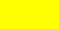
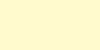
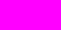
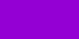
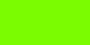
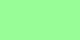
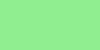
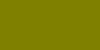
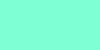
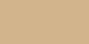

# Colors

## Color formats

Every command that takes a color accepts any of these:

| Format | Example |
| --- | --- |
| HEX, with or without `#` | `F5DF4D`, `#F5DF4D`, `#FD4` |
| CSS color name (list below, case and spaces don't matter) | `royalblue`, `Royal Blue` |
| RGB | `rgb(245, 223, 77)` |
| HSL | `hsl(52, 89%, 63%)` |
| CMYK | `cmyk(0%, 9%, 69%, 4%)` |
| Random color | `random` |
| Another user's color | `@kaaroll99` |
| Gradient preset or holographic* | `sunset`, `holographic` |


Discord treats pure black `#000000` as "no color", so HueTweaker sets `#000001` instead. It looks the same.


\* Presets work in [`/set`](../commands/set.md), [`/gradient`](../commands/gradient.md), [`/favorites add`](../commands/favorites-add.md), [`/setup select`](../commands/setup-select.md) and [`/force set`](../commands/force-set.md), not in [`/check`](../commands/check.md). Using one needs Server Boost and a [vote](voting.md).

`random` and `@user` don't work in [`/setup select`](../commands/setup-select.md). Copying only works when the other user has a HueTweaker color. All presets are listed in [`/colors`](../commands/colors.md) → **Gradients**.

## CSS color names

Both spellings work for grays: `gray` / `grey`, `darkgray` / `darkgrey`, and so on.

### Red colors

<table data-column-title-hidden data-view="cards" data-full-width="false"><thead><tr><th>Color</th><th>Name</th><th>HEX</th></tr></thead><tbody><tr><td></td><td>IndianRed</td><td>#CD5C5C</td></tr><tr><td></td><td>LightCoral</td><td>#F08080</td></tr><tr><td></td><td>Salmon</td><td>#FA8072</td></tr><tr><td></td><td>DarkSalmon</td><td>#E9967A</td></tr><tr><td></td><td>Crimson</td><td>#DC143C</td></tr><tr><td></td><td>Red</td><td>#FF0000</td></tr><tr><td></td><td>FireBrick</td><td>#B22222</td></tr><tr><td></td><td>DarkRed</td><td>#8B0000</td></tr></tbody></table>

### Pink colors

<table data-column-title-hidden data-view="cards"><thead><tr><th>Color</th><th>Name</th><th>HEX</th></tr></thead><tbody><tr><td></td><td>Pink</td><td>#FFC0CB</td></tr><tr><td></td><td>LightPink</td><td>#FFB6C1</td></tr><tr><td></td><td>HotPink</td><td>#FF69B4</td></tr><tr><td></td><td>DeepPink</td><td>#FF1493</td></tr><tr><td></td><td>MediumVioletRed</td><td>#C71585</td></tr><tr><td></td><td>PaleVioletRed</td><td>#DB7093</td></tr></tbody></table>

### Orange colors

<table data-column-title-hidden data-view="cards"><thead><tr><th>Color</th><th>Name</th><th>HEX</th></tr></thead><tbody><tr><td></td><td>LightSalmon</td><td>#FFA07A</td></tr><tr><td></td><td>Coral</td><td>#FF7F50</td></tr><tr><td></td><td>Tomato</td><td>#FF6347</td></tr><tr><td></td><td>OrangeRed</td><td>#FF4500</td></tr><tr><td></td><td>DarkOrange</td><td>#FF8C00</td></tr><tr><td></td><td>Orange</td><td>#FFA500</td></tr></tbody></table>

### Yellow colors

<table data-column-title-hidden data-view="cards"><thead><tr><th>Color</th><th>Name</th><th>HEX</th></tr></thead><tbody><tr><td></td><td>Gold</td><td>#FFD700</td></tr><tr><td></td><td>Yellow</td><td>#FFFF00</td></tr><tr><td></td><td>LightYellow</td><td>#FFFFE0</td></tr><tr><td></td><td>LemonChiffon</td><td>#FFFACD</td></tr><tr><td></td><td>LightGoldenrodYellow</td><td>#FAFAD2</td></tr><tr><td></td><td>PapayaWhip</td><td>#FFEFD5</td></tr><tr><td></td><td>Moccasin</td><td>#FFE4B5</td></tr><tr><td></td><td>PeachPuff</td><td>#FFDAB9</td></tr><tr><td></td><td>PaleGoldenrod</td><td>#EEE8AA</td></tr><tr><td></td><td>Khaki</td><td>#F0E68C</td></tr><tr><td></td><td>DarkKhaki</td><td>#BDB76B</td></tr></tbody></table>

### Purple colors

<table data-column-title-hidden data-view="cards"><thead><tr><th>Color</th><th>Name</th><th>HEX</th></tr></thead><tbody><tr><td></td><td>Lavender</td><td>#E6E6FA</td></tr><tr><td></td><td>Thistle</td><td>#D8BFD8</td></tr><tr><td></td><td>Plum</td><td>#DDA0DD</td></tr><tr><td></td><td>Violet</td><td>#EE82EE</td></tr><tr><td></td><td>Orchid</td><td>#DA70D6</td></tr><tr><td></td><td>Fuchsia</td><td>#FF00FF</td></tr><tr><td></td><td>Magenta</td><td>#FF00FF</td></tr><tr><td></td><td>MediumOrchid</td><td>#BA55D3</td></tr><tr><td></td><td>MediumPurple</td><td>#9370DB</td></tr><tr><td></td><td>RebeccaPurple</td><td>#663399</td></tr><tr><td></td><td>BlueViolet</td><td>#8A2BE2</td></tr><tr><td></td><td>DarkViolet</td><td>#9400D3</td></tr><tr><td></td><td>DarkOrchid</td><td>#9932CC</td></tr><tr><td></td><td>DarkMagenta</td><td>#8B008B</td></tr><tr><td></td><td>Purple</td><td>#800080</td></tr><tr><td></td><td>Indigo</td><td>#4B0082</td></tr><tr><td></td><td>SlateBlue</td><td>#6A5ACD</td></tr><tr><td></td><td>DarkSlateBlue</td><td>#483D8B</td></tr><tr><td></td><td>MediumSlateBlue</td><td>#7B68EE</td></tr></tbody></table>

### Green colors

<table data-column-title-hidden data-view="cards"><thead><tr><th>Color</th><th>Name</th><th>HEX</th></tr></thead><tbody><tr><td></td><td>GreenYellow</td><td>#ADFF2F</td></tr><tr><td></td><td>Chartreuse</td><td>#7FFF00</td></tr><tr><td></td><td>LawnGreen</td><td>#7CFC00</td></tr><tr><td></td><td>Lime</td><td>#00FF00</td></tr><tr><td></td><td>LimeGreen</td><td>#32CD32</td></tr><tr><td></td><td>PaleGreen</td><td>#98FB98</td></tr><tr><td></td><td>LightGreen</td><td>#90EE90</td></tr><tr><td></td><td>MediumSpringGreen</td><td>#00FA9A</td></tr><tr><td></td><td>SpringGreen</td><td>#00FF7F</td></tr><tr><td></td><td>MediumSeaGreen</td><td>#3CB371</td></tr><tr><td></td><td>SeaGreen</td><td>#2E8B57</td></tr><tr><td></td><td>ForestGreen</td><td>#228B22</td></tr><tr><td></td><td>Green</td><td>#008000</td></tr><tr><td></td><td>DarkGreen</td><td>#006400</td></tr><tr><td></td><td>YellowGreen</td><td>#9ACD32</td></tr><tr><td></td><td>OliveDrab</td><td>#6B8E23</td></tr><tr><td></td><td>Olive</td><td>#808000</td></tr><tr><td></td><td>DarkOliveGreen</td><td>#556B2F</td></tr><tr><td></td><td>MediumAquamarine</td><td>#66CDAA</td></tr><tr><td></td><td>DarkSeaGreen</td><td>#8FBC8F</td></tr><tr><td></td><td>LightSeaGreen</td><td>#20B2AA</td></tr><tr><td></td><td>DarkCyan</td><td>#008B8B</td></tr><tr><td></td><td>Teal</td><td>#008080</td></tr></tbody></table>

### Blue colors

<table data-column-title-hidden data-view="cards" data-full-width="false"><thead><tr><th>Color</th><th>Name</th><th>HEX</th></tr></thead><tbody><tr><td></td><td>Aqua</td><td>#00FFFF</td></tr><tr><td></td><td>Cyan</td><td>#00FFFF</td></tr><tr><td></td><td>LightCyan</td><td>#E0FFFF</td></tr><tr><td></td><td>PaleTurquoise</td><td>#AFEEEE</td></tr><tr><td></td><td>Aquamarine</td><td>#7FFFD4</td></tr><tr><td></td><td>Turquoise</td><td>#40E0D0</td></tr><tr><td></td><td>MediumTurquoise</td><td>#48D1CC</td></tr><tr><td></td><td>DarkTurquoise</td><td>#00CED1</td></tr><tr><td></td><td>CadetBlue</td><td>#5F9EA0</td></tr><tr><td></td><td>SteelBlue</td><td>#4682B4</td></tr><tr><td></td><td>LightSteelBlue</td><td>#B0C4DE</td></tr><tr><td></td><td>PowderBlue</td><td>#B0E0E6</td></tr><tr><td></td><td>LightBlue</td><td>#ADD8E6</td></tr><tr><td></td><td>SkyBlue</td><td>#87CEEB</td></tr><tr><td></td><td>LightSkyBlue</td><td>#87CEFA</td></tr><tr><td></td><td>DeepSkyBlue</td><td>#00BFFF</td></tr><tr><td></td><td>DodgerBlue</td><td>#1E90FF</td></tr><tr><td></td><td>CornflowerBlue</td><td>#6495ED</td></tr><tr><td></td><td>RoyalBlue</td><td>#4169E1</td></tr><tr><td></td><td>Blue</td><td>#0000FF</td></tr><tr><td></td><td>MediumBlue</td><td>#0000CD</td></tr><tr><td></td><td>DarkBlue</td><td>#00008B</td></tr><tr><td></td><td>Navy</td><td>#000080</td></tr><tr><td></td><td>MidnightBlue</td><td>#191970</td></tr></tbody></table>

### Brown colors

<table data-column-title-hidden data-view="cards"><thead><tr><th>Color</th><th>Name</th><th>HEX</th></tr></thead><tbody><tr><td></td><td>Cornsilk</td><td>#FFF8DC</td></tr><tr><td></td><td>BlanchedAlmond</td><td>#FFEBCD</td></tr><tr><td></td><td>Bisque</td><td>#FFE4C4</td></tr><tr><td></td><td>NavajoWhite</td><td>#FFDEAD</td></tr><tr><td></td><td>Wheat</td><td>#F5DEB3</td></tr><tr><td></td><td>BurlyWood</td><td>#DEB887</td></tr><tr><td></td><td>Tan</td><td>#D2B48C</td></tr><tr><td></td><td>RosyBrown</td><td>#BC8F8F</td></tr><tr><td></td><td>SandyBrown</td><td>#F4A460</td></tr><tr><td></td><td>Goldenrod</td><td>#DAA520</td></tr><tr><td></td><td>DarkGoldenrod</td><td>#B8860B</td></tr><tr><td></td><td>Peru</td><td>#CD853F</td></tr><tr><td></td><td>Chocolate</td><td>#D2691E</td></tr><tr><td></td><td>SaddleBrown</td><td>#8B4513</td></tr><tr><td></td><td>Sienna</td><td>#A0522D</td></tr><tr><td></td><td>Brown</td><td>#A52A2A</td></tr><tr><td></td><td>Maroon</td><td>#800000</td></tr></tbody></table>

### White colors

<table data-column-title-hidden data-view="cards"><thead><tr><th>Color</th><th>Name</th><th>HEX</th></tr></thead><tbody><tr><td></td><td>White</td><td>#FFFFFF</td></tr><tr><td></td><td>Snow</td><td>#FFFAFA</td></tr><tr><td></td><td>HoneyDew</td><td>#F0FFF0</td></tr><tr><td></td><td>MintCream</td><td>#F5FFFA</td></tr><tr><td></td><td>Azure</td><td>#F0FFFF</td></tr><tr><td></td><td>AliceBlue</td><td>#F0F8FF</td></tr><tr><td></td><td>GhostWhite</td><td>#F8F8FF</td></tr><tr><td></td><td>WhiteSmoke</td><td>#F5F5F5</td></tr><tr><td></td><td>SeaShell</td><td>#FFF5EE</td></tr><tr><td></td><td>Beige</td><td>#F5F5DC</td></tr><tr><td></td><td>OldLace</td><td>#FDF5E6</td></tr><tr><td></td><td>FloralWhite</td><td>#FFFAF0</td></tr><tr><td></td><td>Ivory</td><td>#FFFFF0</td></tr><tr><td></td><td>AntiqueWhite</td><td>#FAEBD7</td></tr><tr><td></td><td>Linen</td><td>#FAF0E6</td></tr><tr><td></td><td>LavenderBlush</td><td>#FFF0F5</td></tr><tr><td></td><td>MistyRose</td><td>#FFE4E1</td></tr></tbody></table>

### Gray colors

<table data-column-title-hidden data-view="cards"><thead><tr><th>Color</th><th>Name</th><th>HEX</th></tr></thead><tbody><tr><td></td><td>Gainsboro</td><td>#DCDCDC</td></tr><tr><td></td><td>LightGray</td><td>#D3D3D3</td></tr><tr><td></td><td>Silver</td><td>#C0C0C0</td></tr><tr><td></td><td>DarkGray</td><td>#A9A9A9</td></tr><tr><td></td><td>Gray</td><td>#808080</td></tr><tr><td></td><td>DimGray</td><td>#696969</td></tr><tr><td></td><td>LightSlateGray</td><td>#778899</td></tr><tr><td></td><td>SlateGray</td><td>#708090</td></tr><tr><td></td><td>DarkSlateGray</td><td>#2F4F4F</td></tr><tr><td></td><td>Black</td><td>#000000</td></tr></tbody></table>
